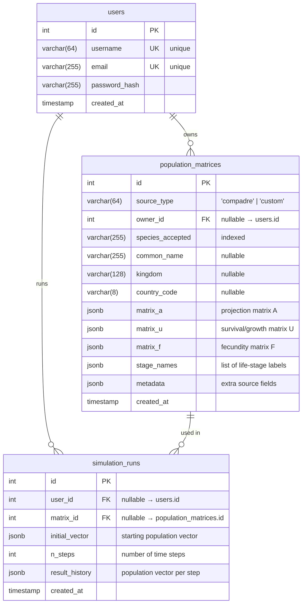

# Database Schema

## Entity-Relationship Diagram



---

## Table Descriptions

### `users`

Stores application accounts. Optional — matrices and simulation runs can exist without an owner (`owner_id` / `user_id` are nullable to support anonymous or pre-loaded data like COMPADRE).

| Column | Type | Notes |
|---|---|---|
| `id` | `integer` | Auto-increment primary key |
| `username` | `varchar(64)` | Unique, required |
| `email` | `varchar(255)` | Unique, required |
| `password_hash` | `varchar(255)` | Bcrypt or similar hash |
| `created_at` | `timestamp` | Server default: `now()` |

---

### `population_matrices`

Central table. Stores one row per population projection matrix, regardless of origin (COMPADRE, user-defined, etc.). The three sub-matrices A = U + F follow the standard COMPADRE decomposition.

| Column | Type | Notes |
|---|---|---|
| `id` | `integer` | Auto-increment primary key |
| `source_type` | `varchar(64)` | `'compadre'` for seeded data, `'custom'` for user uploads |
| `owner_id` | `integer` | FK → `users.id`, nullable |
| `species_accepted` | `varchar(255)` | Taxonomically accepted name; indexed |
| `common_name` | `varchar(255)` | Nullable |
| `kingdom` | `varchar(128)` | e.g. `'Plantae'`, `'Animalia'` |
| `country_code` | `varchar(8)` | Country of study (ISO or COMPADRE 3-letter code) |
| `matrix_a` | `jsonb` | Full projection matrix A (2D array of floats) |
| `matrix_u` | `jsonb` | Survival/growth sub-matrix U |
| `matrix_f` | `jsonb` | Fecundity sub-matrix F |
| `stage_names` | `jsonb` | List of life-stage labels e.g. `["Seedling", "Juvenile", "Adult"]` |
| `metadata` | `jsonb` | Source-specific extras (MatrixID, Authors, DOI, etc.) |
| `created_at` | `timestamp` | Server default: `now()` |

**Index:** `ix_population_matrices_species_accepted` on `species_accepted` — supports fast species lookup in the UI dropdown.

#### Matrix format (JSONB)

Each matrix is stored as a 2D JSON array (list of rows):

```json
[
  [0.0,  0.0,  44.4],
  [0.03, 0.11, 0.08],
  [0.01, 0.59, 0.68]
]
```

`null` values appear in cells where data was not available in the source (NaN in the original R object).

---

### `simulation_runs`

Records each execution of the population simulator. Stores both the input (initial vector, number of steps, which matrix) and the full output (population vector at every time step), so results can be retrieved and compared without re-running.

| Column | Type | Notes |
|---|---|---|
| `id` | `integer` | Auto-increment primary key |
| `user_id` | `integer` | FK → `users.id`, nullable |
| `matrix_id` | `integer` | FK → `population_matrices.id`, nullable |
| `initial_vector` | `jsonb` | Starting population per stage e.g. `[100, 0, 0]` |
| `n_steps` | `integer` | How many time steps to simulate |
| `result_history` | `jsonb` | 2D array: one population vector per step |
| `created_at` | `timestamp` | Server default: `now()` |

#### `result_history` format

```json
[
  [100, 0, 0],
  [97,  3, 0],
  [91,  9, 1],
  ...
]
```

Row `i` is the population vector at time step `i`.

---

## Indexes

| Index name | Table | Column | Purpose |
|---|---|---|---|
| `ix_population_matrices_species_accepted` | `population_matrices` | `species_accepted` | Fast species search in UI |

Primary keys on all tables are implicitly indexed by PostgreSQL.

---

## Migration history

| Revision | Description |
|---|---|
| `0001` | Initial schema — creates `users`, `population_matrices`, `simulation_runs` and the species index |

New migrations are added via:

```bash
python -m alembic revision --autogenerate -m "description"
python -m alembic upgrade head
```
